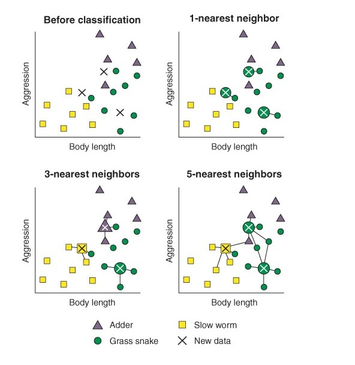

```{r setup, include=FALSE}
knitr::opts_chunk$set(echo = TRUE)
```

## K-Nearest Neighbours
KNN is used to classify unlabelled items based on **feature similarities** with **K Nearest Neighbours**. 


Procedures of CNN:

1. Select the features
2. KNN algorithm calculates the **distance (based on the features)** between the unlabelled and all labelled cases
3. Select the nearest K candidates based on the distance
4. Let the K candidates vote





## Explore The Data
```{r install-package, echo = F, message = F, error = F}
#install.packages("mlr", dependencies = T)
library(mlr)
library(tidyverse)
```

```{r}
data(diabetes, package = "mclust")
diabetesTib <- as_tibble(diabetes)
summary(diabetesTib)
head(diabetesTib)
```

```{r}
ggplot(diabetesTib, aes(glucose, insulin, col = class)) + geom_point() + theme_bw()
ggplot(diabetesTib, aes(sspg, insulin, col = class)) + geom_point() + theme_bw()
ggplot(diabetesTib, aes(sspg, glucose, col = class)) + geom_point() + theme_bw()
```


## Using "mlr" package to train the kNN model
It is important to standardize the predictor variables in the machine learning algorithms. The kNN algorithm wrapped in the mlr package has done this for users.

Building a machine learning model with mlr package in three stages:

1. **Define the task**: specify the predictors and outcomes
2. **Define the learner**: the name of the algorithm to use (with additional parameters)
3. **Train the model**: pass the task(data) to the learner

### Step 1: Define the task -- the outcome and the predictors


```{r, warning= F}
diabetesTask <- makeClassifTask(data = diabetesTib, target = "class") 
diabetesTask
```


### Step 2: Define the learner -- algorithm 


```{r }
knn <- makeLearner("classif.knn", par.vals = list("k" = 2))

```

We can also use `listLearners("classif")$class` to list all available learners. 


### Step 3: Train the model


```{r}
knnModel <- train(knn, diabetesTask)

```


### Model Assessment -- Performance


The predicted valuea is then compared to the true label based on the measure we select. The measure can be *mmce*, mean misclassification error, or *acc*, accurancy.

```{r, warning= F}
knnPred <- predict(knnModel, newdata = diabetesTib)
knnPred
performance(knnPred, measures = list(mmce, acc))
```


